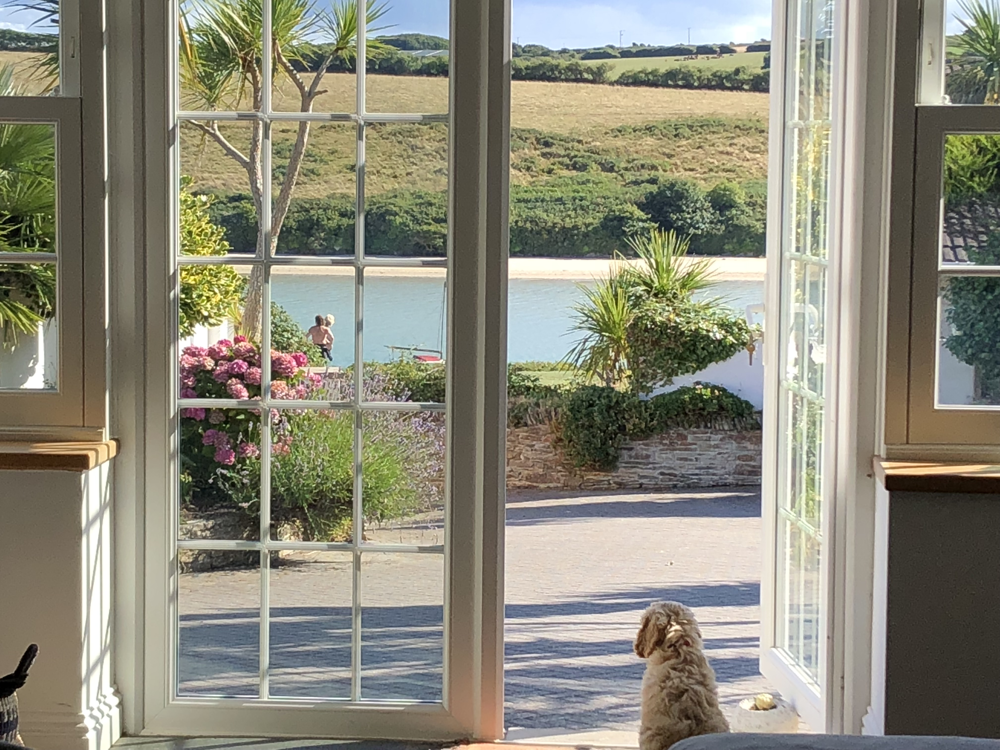

It's funny how things come full circle and the things you dream about when you are young have a way of staying with you.

I first met my husband when we were both 12 when he knocked me off my roller skates cutting my knee, we started dating when we were 15. He was an avid reader and loved stories of adventure, I was a art student immersed in the world of colour and gesture. Living in an industrial town in Lancashire we both loved exploring the open moorland yet dreamt of living by the sea.

We arrived in Cornwall aged 18 in the mid 70's looking for work with just £10 in our pocket between us, camping for the night on a small beach just on the outskirts of town next to open fields of poppies, sharing what food we had left.

Opposite was an abandoned farmhouse, a shell of a building were we imagined ourselves playing house and raising a family, it quickly became our favourite place to escape from the hurley burley of life.

Fast forward 40+ years and we are now living in the farmhouse, my husband has his library, I have my studio.

Despite the ups and downs and the scrapes and bruises of life its a home that over the years has always provided a soft landing, not just for us, but for others too. I am the perfect example of its never to late to be who you want to be and have the life you dreamt of.

